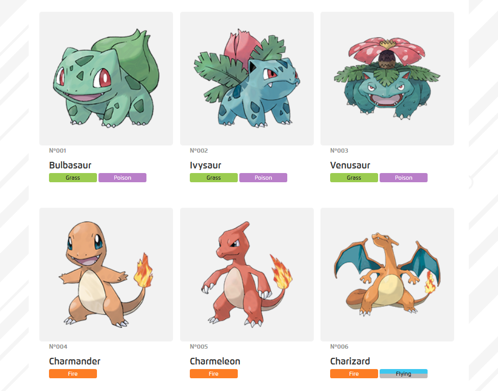
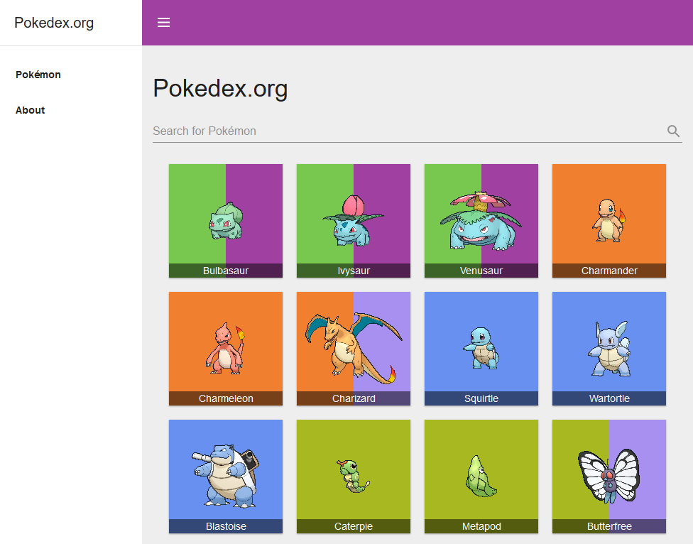

# USUCAMPEÃO Tecnologia em Regularização Imobiliária

Somos mais que uma Startup de regularização de imóveis, nascemos para resolver um problema social que atinge mais de 50% da população brasileira.

Através da inovação, execução de qualidade e baixo custo realizamos o sonho da propriedade regularizada.

Nosso propósito é gerar segurança jurídica e #prosperidade a todas as pessoas.

*Venha fazer parte deste time CAMPEÃO!!!*

## Desenvolvedor Front-End

Então, quer dizer que você gosta de desafios e quer se tornar um desenvolvedor front-end na UsuCampeão? Está no lugar certo!

Este teste faz parte do nosso processo de seleção e é a sua chance de nos mostrar todo o seu conhecimento como desenvolvedor front-end com angular. Este teste está dividido em duas etapas:

1. Responder um questionário sobre HTML, CSS, JavaScript e Angular
1. Desenvolver uma aplicação simples, demonstrando seu conhecimento na prática

Daremos um feedback a todos os que fizerem o Pull Request.

O questionário e a especificação da aplicação estão logo abaixo.

A sua entrega será feita através de um Pull Request nesse repositório. Faça um fork do repositório, implemente o seu código, responda as questões no README.md e faça um pull request. Sinta-se a vontade para colocar quaisquer outras informações que você considere pertinente no README.

### Instruções:

1. Faça um fork deste repositório;
1. Responda as questões no README.md - caso prefira, podemos conversar sobre elas na entrevista;
1. Construa uma aplicação conforme solicitado, utilizando HTML, CSS e Angular;
1. Adicione quaisquer informações adicionais para executar sua aplicação no README.md;
1. Após terminar, submeta um pull request e aguarde seu feedback.

**PS:** Utilizamos este mesmo testes para os níveis (**júnior**, **pleno** ou **sênior**), apenas adequando o nível de exigência na avaliação de acordo com o perfil da vaga.

### Questionário

1. O que são ``components`` e ``directives`` e quais as difenças entre eles? Dê alguns exemplos de utilização.
R: Diretivas são uma forma do Angular manipular o comportamento e/ou aparencia de um elemento. Por exemplo, o *ngIf é uma diretiva estrutural que elimina um elemento da DOM dependendo da condição passada a ele, já o NgClass é uma diretiva de atributo que pode ser utilizada de varias formas para adicionar uma classe a um elemento.
Um componente é uma diretiva, porém é usada para construir a aplicação, sem ela não temos uma aplicação propriamente dita. Talvez a maior diferença são os requisitos de um componente pra uma diretiva estrutural ou de atributo, como por exemplo a necessidade de um template e uma classe

2. O que são ``services``? Dê alguns exemplos de utilização.
R: Serviços são classes injetaveis que tem como as principais funções cuidar a lógica de negócio e compartilhar informação com a aplicação. Como os componentes devem apenas apresentar dados e tratar do que é referente ao template dele, os services são utilizados para fazer comunicação.
Dois exemplos de serviços que posso dar são: o serviço de HTTPClient que serve para disponibilizar os metodos para chamadas HTTP para a aplicação toda e um serviço de usuarios, por exemplo, criado pelo próprio desenvolvedor e que teria a função de carregar dados de usuarios, criar, deletar, editar e disponibilizar esses dados para os componentes.

3. O que são ``pipes``? Dê alguns exemplos de utilização.
R: Pipes são classes que tem como intuito manipular dados e devolver esse dado alterado de acordo com as opções que forem atribuidas no uso, ou da forma que foi escrita pelo desenvolvedor. Um exemplo é o DatePipe, que recebe um objeto de data e, a partir das opções concatenadas, devolve uma data formatada.

4. O que é ``data-binding`` e quais os tipos que o Angular dá suporte?
R: Data Binding é a forma que o Angular tem de fazer a comunicação entre o template é a classe que controla o componente. Temos o binding de eventos que é caracterizado pelo () e serve para comunicar para a classe eventos que tenham sido disparados no template. Temos o binding de atributo, caracterizado por [] e que faz com que atributos envolvidos em colchetes recebam dados da classe. E também temos o two way data binding, que era conhecido (não sei se é mais) por "banana in a box" pelo seu formato, pois se usa com [()]. Esse binding recebe e envia dados entre o template e componente, por isso "two way";
Não sei se entra como binding, mas talvez a interpolação com {{}} possa ser também, já que recebe dados que são exibidos no template.

5. Como se adiciona um *listener* de eventos do usuário em um componente? Por exemplo, como adicionar uma função que responde a um clique de usuário?
R: Bom, como está com o *listener* dessa forma não creio que entra aqui escutar um evento pelo binding de (). Mas caso seja valido, podemos ter um binding de evento, como por exemplo o (click), ou então utilizar o decorador de @HostListener para adicionar um listener de evento á uma diretiva.

6. Quais as diferenças entre ``constructor`` e ``ngOnInit``, e quando devemos usar cada um?
R: O construtor faz parte da classe do JavaScript e o ngOnInit é um lifecycle hook do Angular, eles são metodos executados em tempos diferentes durante a criação de um componente. O constructor é mais utilizado para injetar as dependencias de uma classe na sua construção. O NgOnInit é utilizado para executar metodos e popular propriedades da classe assim que o angular já tiver feito o minimo para que a classe seja utilizada, mas não o suficiente para ter algo concreto na view.

7. Quais as diferenças entre ``Observables`` e ``Promises``? Como você o utilizaria cada um em um ``template``?
R: Promises são um conceito de programação asincrona no JavaScript onde você espera que um metodo execute e devolva um resultado ou um erro antes de continuar a execução do código, normalmente se usam high order functions e async/await com promises e é algo nativo do JS. Observables são um outro conceito, porém não é nativo e no Angular utilizamos a lib RXJS pra isso. Nos observaveis você tem basicamente um objeto que dispara valores e que pode ser assinado por outros objetos, ao assinar um observavel você fica """"observando"""" até ele disparar um valor que você possa utilizar.

Quanto a utilização em templates não vou mentir aqui que nunca usei uma promise direto num template, não sei se da pra fazer isso com o pipe de async, mas o observável é possível fazer isso. Você utilizar um observavel e passa o pipe de async, com isso o pipe da um subscribe automaticamente e devolve os itens para a diretiva que está utilizando. Além do subscribe automatico, quando acontecer o lyfecycle de onDestroy, o unsubscribe é executado automaticamente.

8. Quais as diferenças entre ``template-driven forms`` e ``reactive forms``? Como fazer validação de dados de formulário em cada caso?
R:Bom, template driven são forms criados no template e que você utiliza uma referencia ao form para manipulá-los na classe, já Reactive Forms são formulários criados pela classe e que são atribuidos como propriedade no formulário. Não sei se as diferenças vão muito além da forma que você escreve e validação com validators customizados e asincronos.

Já a validação, utilizei pouco o form de template, mas lembro que as validações eram feitas através de atributos dos inputs mesmo, certo? Já forms reativos você tem uma classe de validatos
que utiliza para validar seus controladores, FormArrays e FormGroups, além de poder criar seus próprios validadores.

9.  Como se utiliza o ``angular router``? Quais são as formas de enviar parâmetros para uma rota?
R: Na forma mais basica, você define rotas e quais componentes essa rota deve exibir. Ao navegar para determinada URL essa rota é exibida no elemento router-outlet.
Você pode enviar parametros, por exemplo, definindo que o caminho pra uma rota será um parametro (ex: path: ':id') e pegar esse parametro na próxima página. Você pode utilizar o atributo queryParams junto de um routerLink e passar parametros. Da mesma forma pode utilizar o fragment. E também pode enviar utilizando o serviço de Router e passar como state, por exemplo.

10.  O que são *guards de rota* e para que são úteis?
R: Guards de rotas são metodos que podem ser atribuidos as rotas no router e que fazem a segurança de uma rota, executando um bloco de código para assegurar que a navegação para aquela rota pode acontecer, se as condições forem superadas.
Alguns casos onde um guard é útil é quando usuários tem permissões para usar certas funcionalidades de um sistema. Com um guard você pode facilmente verificar, antes do usuário acessar uma rota, se ele tem permissão para isso. Ou mesmo verificar se ele está logado antes de acessar uma home, por exemplo.

11. O que é ``NgZone``? Em que momento deve ser utilizada?
R: aaaa vou ficar devendo essa, vou pegar pra ler melhor, mas sei que é algo sobre contexto de execução, persistir dados.

12. O que é *injeção de dependências* e por que isso é útil? Como você realiza injeção de dependências entre módulos?
R: Essa é algo que sempre enrosco pra explicar. Injeção de dependência é um conceito, um design pattern, onde você disponibiliza serviços para um componente ou outra classe sem criar uma nova instância desse serviço, fazendo com que os dados persistam entre as classes sem perder o estado atual dela e com isso a aplicação inteira tem acesso aos mesmos dados, e o que acontece em um componente reflete nos outros que dependem do mesmo componente.

É útil por isso, disponibilizar os mesmos dados pra aplicação inteira. Porém deve-se tomar muito cuidado com efeitos colaterais ao alterar um valor em um serviço.

A forma maios atual se se injetar é utilizar o metadado 'providedIn': root no decorador de um serviço (@Injectable), com isso o serviço já fica disponível para uso em toda a aplicação. Outra forma é passar um serviço no array de providers em um módulo, com isso o serviço já fica disponivel para ser usado no componente e componentes filhos desse módulo.

Ah, e a mais importante de todas: Bulbassauro, Charmander ou Squirtle? =)
R: hahahaha essa é a mais difícil aqui em? Olha acho o Charmander o mais legal, gosto dele e das evoluções. Maaaaas sempre vou de Bulbassauro, é super efetivo nos 2 primeiros ginásios e se vira bem nos outros, tem um HP bom, mas não gosto muito dos ataques dele na última evolução. Squirtle acho bom também, primeiro ginásio passa sossegado e você pega bastante pokémon de grama nas primeiras áreas, o que ajuda contra os próximos 2 ginásios. Fora que o HP e defesa dele são bem altos, da pra brincar bastante.

### Projeto: Criando uma Pokédex usando a PokéAPI

Pokémon é uma enorme franquia com jogos, desenhos, filmes, brinquedos e diversos produtos mundialmente conhecidos. Da [Wikipédia](https://pt.wikipedia.org/wiki/Pokémon_(série_de_jogos_eletrônicos)):

> Pokémon é uma série de jogos eletrônicos desenvolvidos pela Game Freak e publicados pela Nintendo como parte da franquia de mídia Pokémon. Lançado pela primeira vez em 1996 no Japão para o console Game Boy, a principal série de jogos de RPGs, que continuou em cada geração em portáteis da Nintendo.
> 
> Os jogos são geralmente lançados em pares - cada um com pequenas variações - com uma recriação aprimorado dos usados jogos lançados em alguns anos depois das versões originais. Enquanto a série principal consiste em RPGs, os spin-off abrangem outros gêneros, como RPG de ação, quebra-cabeça e jogos virtuais para animais de estimação.
> 
> A partir de 24 de novembro de 2017, mais de 300 milhões de jogos de Pokémon foram vendidos em todo o mundo, em 76 títulos. Isso faz de Pokémon a segunda franquia de jogos eletrônicos mais vendidas, atrás da própria franquia da Nintendo Mario.

Em 2016, a Nintendo lançou o jogo Pokémon Go, para Android e iOS, que permitia aos jogadores "caçar" Pokémons no "mundo real" através de realidade aumentada, utilizando o GPS e a câmera dos celulares dos jogadores. Seus monstrinhos capturados ficavam listados na chamada Pokédex, um acervo de Pokémons que já existia desde o primeiro jogo.

Seu objetivo, neste projeto, é criar uma Pokédex em Angular usando a PokéAPI.

A [PokéAPI](https://pokeapi.co/) é uma API aberta, sem necessidade de  disponibiliza uma API REST com, entre outras coisas, informações de todos os Pokémons até a geração 7. Você pode consultar a documentação da API [aqui](https://pokeapi.co/docs/v2).

Você é livre para montar a aplicação como quiser, mas gostaríamos de ver a listagem de todos o Pokémons, com informações básicas, em uma página inicial e detalhes do Pokémon selecionado em outra página. Como referência de layout, recomendamos que utilize as seguintes Pokédex como exemplo:

- [Pokédex oficial](https://www.pokemon.com/br/pokedex/)

(link: [https://www.pokemon.com/br/pokedex/](https://www.pokemon.com/br/pokedex/))

- [Pokedex.org](https://pokedex.org/)

(link: [https://pokedex.org/](https://pokedex.org/))

Temos alguns pré-requisitos:
- Utilização de Angular 8+;
- Uso de SASS/SCSS para CSS da aplicação;
- Design responsivo;
- Ah, e não se esqueça de mostrar os sprites (as imagens) de cada Pokémon!

Além disso, vamos avaliar como você organiza e documenta o projeto, e a estrutura de módulos, componentes, serviços e rotas que você criou.

Ganhe pontos extras por:
- Uso de Angular Material;
- Layout diferenciado e animações;
- Mecanismo de pesquisa;
- Cache e persistência dos dados no ``localStorage`` ou ``IndexedDB``;
- Funcionamento offline com os dados cacheados - melhor ainda se for um PWA!;
- Testes unitários e end to end;
- Scripts de deploy;
- Organização e mensagens dos commits.

E não se esqueça, bugs e exceções são como Pokémons: *Gotta catch 'em all!*

**Boa sorte! =)**
